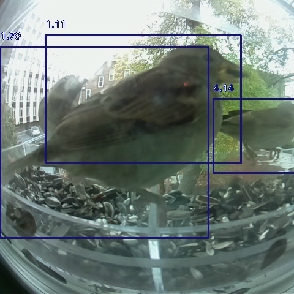

# AI Bird Watching

My birds need to be watched, but I cannot always watch them. Using the
ImageAI Python library I can do this easily. With ~20 lines of code I can
find if there are any birds in an image, and count how many with varying
degrees of accuracy.

The `setup_detector` function sets up the `ObjectDetection` model from
[ImageAI](https://github.com/OlafenwaMoses/ImageAI).
In this model I choose to load the
[TinyYoloV3 model](https://github.com/OlafenwaMoses/ImageAI/releases/download/1.0/yolo-tiny.h5),
chosen because it is the most lightweight model, and I plan to run this on
my Raspberry PI.

```python
from imageai.Detection import ObjectDetection

def setup_detector():
  """
  Build the detection model
  :return: The detection model
  """
  execution_path = os.getcwd()
  detector = ObjectDetection()
  detector.setModelTypeAsTinyYOLOv3()
  detector.setModelPath(os.path.join(execution_path, "./yolo-tiny.h5"))
  detector.loadModel()
```

Using this model it is time to detect the birds. I only want to see the
birds in the image do I set the `CustomObjects` to birds only. Then by
feeding in my input image I get the image seen below as output.

```python
import os

def process_picture(image_path, output_path):
  """
  Process the input image
  :param image_path: Input image path
  :param output_path: Output image path
  :return: Found objects
  """
  detector = setup_detector()
  custom_object = detector.CustomObjects(bird=True)
  detections = detector.detectObjectsFromImage(custom_objects=custom_object,
                                               input_image=image_path,
                                               output_image_path=output_path,
                                               minimum_percentage_probability=1,
                                               display_object_name=False)

  return detections
```



With these ~20 lines of code we have found all the birds in our image. As
you can see the probability percentages are quite low, but this can be
improved with a different model. The full guide including all model choices
can be found on the full
[ImageAI Detection documentation](https://github.com/OlafenwaMoses/ImageAI/blob/master/imageai/Detection/README.md).