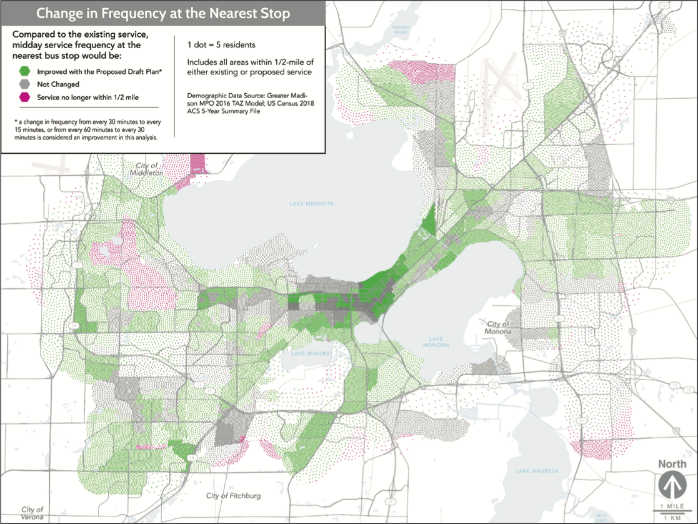

# A New Transit Visualization

Abstract: Local transit systems make me wonder what my [ideal transit visualization](#proposed-visualization) is.

With a cool new transit plan comes a bunch of cool new visualizations. The
City of Madison's metro
transit has been drafting a [Transit Network Redesign](https://www.cityofmadison.com/metro/routes-schedules/transit-network-redesign) and as a public
transportations #1 fan I have been following along.

In [Appendix A](https://madison.legistar.com/View.ashx?M=F&ID=10441388&GUID=5805ED65-B6CC-495D-9F58-461C3183203D)
several visualizations are included highlighting the updated bus route and
the improvements that it will make. For instance in the image below you can see the changes in service frequency by area
in the city.

This visualization got me curious of the other visualizations that were available for public transportation. More specifically
I was looking for a method that could clearly show the effectiveness of a cities public transit. My gripe with the image
above is that I don't care about service frequency. If a bus comes every 10 minutes, but it takes the same amount of time to get
somewhere it does me no good.

The beginning of my quest to find other visualizations that better fit my ideal led me to this [article](https://medium.com/@stevepepple/visualizing-better-transportation-data-tools-e48b8317a21c)
which included an entire list of transit visualizations and examples. Problem is all the visualizations in this list seemed to be iterations of the same idea.
This [blog post](https://www.esri.com/arcgis-blog/products/network-analyst/analytics/cool-tools-for-analysis-with-public-transit-data/) from 2016
summarized well what I was seeing. Visualizations showed distance to transit center, or ease of traveling to certain locations but missed the
opportunity to answer the biggest question, **How fast can I get from A to B?**

## Proposed Visualization

My ideal visualization to show this question is a heatmap with an input start location and color gradient weighted by the amount of
time to reach that location. Overlaying these heatmaps we could find transit dead zones on a map and also can show a cities
progress to lowering travel times when new lines are proposed.

The key difference is that this visualization shows what the others are hinting at.

## Issues

Although I say this is my ideal I can see why this has not been made. Calculating the optimal time to get from one side of town to
the other is complicated by alternate routes, a mixture of transit methods, and the time of day.

## Progress towards Completion

None, I just made this article. 🤷

