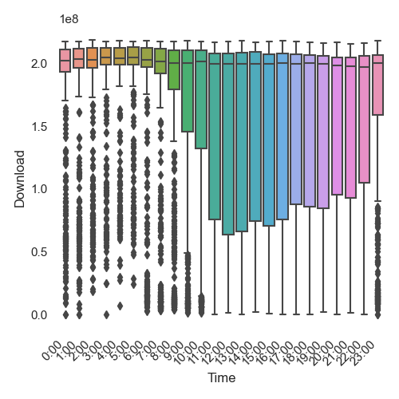

import {Box} from "theme-ui"

# Charter Network Benchmarks

Sometimes my internet seems slower than what I pay for and for that I resent
Charter. Let us find out if that resentment is valid or misplaced.

Null Hypothesis: Download Speeds at 5pm >= Download Speeds at the other hours
of the day

Alternative Hypothesis: Download Speeds at 5pm < Download Speeds at the
other hours of the day

## Collecting the Data

To collect the data that I needed to test this hypothesis I used a Python script
that collected my network data set to run every ten minutes. The script was run
from a raspberry pi hooked up to my router with an ethernet cord to remove
my choppy wifi as a variable. Script details can be found on my
[blog post](/blog/Benchmarking_Network_With_Python).

In the end I generated ~13000 data points over 3 months which can be found
on [github](https://raw.githubusercontent.com/CannonLock/data/master/benchmark.csv).

## Visual Analysis

It's no fun jumping right to the math, lets see if we can spot something
interesting in some graphs.

From this box plot it looks like the download speeds have
increased variance from 10:00 AM and 10:00 PM but consistent medians. Let's
graph the distributions and see if we can get glean any
more information.

From these arrays of graphs and the one that I have blown up it looks like
our data is __not normally distributed__ as I had hoped. Additionally
it isn't [unimodal](https://www.statology.org/unimodal-distribution/),
which means I do not have any tools to transform it to a
normal distribution. This is unfortunate because my plan to use an ANOVA
and a pairwise comparison to investigate my claim is now out the door.

__Next step -> Logistic Regression ( Coming Spring of 2022 )__
